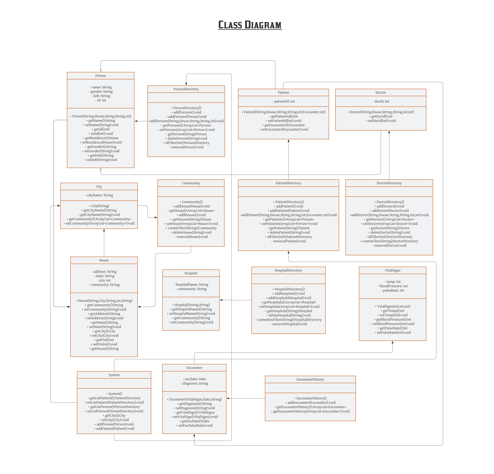

# Jha_RaushanKumar_002707535

INFO 5100 Assignment-2: Application Engineering and Development, Fall 2022

*Instructor*: **Professor Kal Bugrara**

*Made by*: **Raushan Kumar Jha**

> This application is a platform for people to find medical resource in different city and community. 

* **System Admin** can create persons, assign patients and doctors and update the details. Also, can do CRUD on persons, patients, doctors, hospitals and community.  
* **Hospital Admin** can assign patients and doctors and update the details. Also, can do CRUD on hospitals and patients.
* **Community Admin** can do CRUD on community.
* **Doctors** can add Encounters and update details of Vital Signs of patients and can read their details.
* **Patients** can read their details and can search for doctors, hospitals in their community.

## Class

1. Person
2. PersonDirectory
3. Patient
4. PatientDirectory
5. Hospital
6. HospitalDIrectory
7. Encounter
8. EncounterHistory
9. ViralSIgns
10. System
11. Doctor
12. DoctorDirectory
13. House
14. City
15. Community

## UI

1. System Admin Login
2. Patient Login
3. Doctor Login
4. Hospital Admin Login
5. Community Admin Login

## Class Diagram

[Link to Class Diagram](https://lucid.app/lucidchart/8f71227e-d4fe-4fbe-b6b5-772b324d1585/edit?viewport_loc=-164%2C-304%2C3328%2C1548%2CHWEp-vi-RSFO&invitationId=inv_071de2b6-de2b-40b5-905b-d951f2fc6282)

## Sequence Diagram

[Link to Sequence Diagram](https://lucid.app/lucidchart/40bf4f21-ee9e-4a1c-a047-b9c27979989e/edit?viewport_loc=-60%2C-198%2C3328%2C1548%2C0_0&invitationId=inv_c396c745-8ccc-4622-bd2f-6f4132b61bd8)

